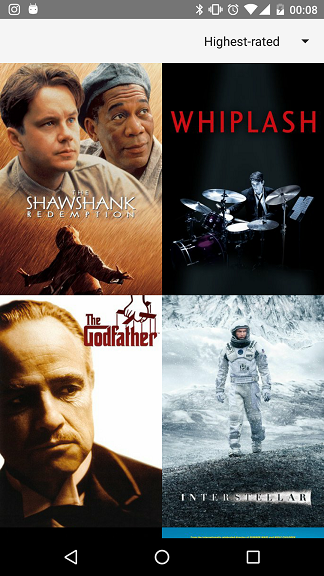
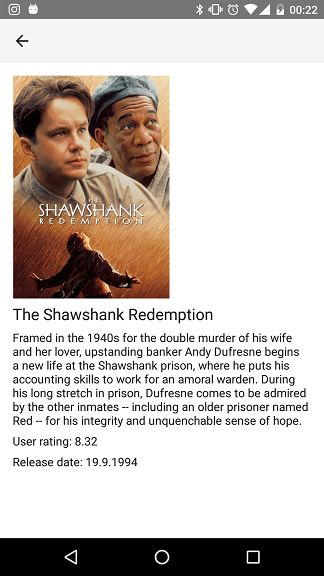

# Popular Movie App Stage 1

This is a small android app, which uses the movie db web API to 
display movie top lists and detail information.

## Screenshots
 

## The movie db API key
A personal movie db API key needs to be applied in [strings.xml](app/src/main/res/values/strings.xml).
The entry should look like this: 
```xml
<string name="the_movie_db_api_key">YOUR_KEY</string>
```

## Used Thirdparty Libraries
+ Volley
+ Picasso

## License

The contents of this repository are covered under the [MIT License](LICENSE)
