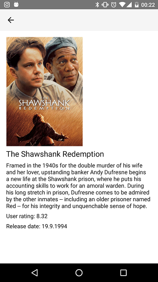

# Popular Movie App Stage 1

## Intro
This is a small android app, which uses the movie db web API to 
display movie top lists and detail information.

### Overview page

### Detail page

## The movie db API key
A personal movie db API key needs to be applied in [strings.xml](app/src/main/res/values/strings.xml).
The entry should look like this: <string name="the_movie_db_api_key">YOUR_KEY</string>

## Used Thirdparty Libraries
+ Volley
+ Picasso